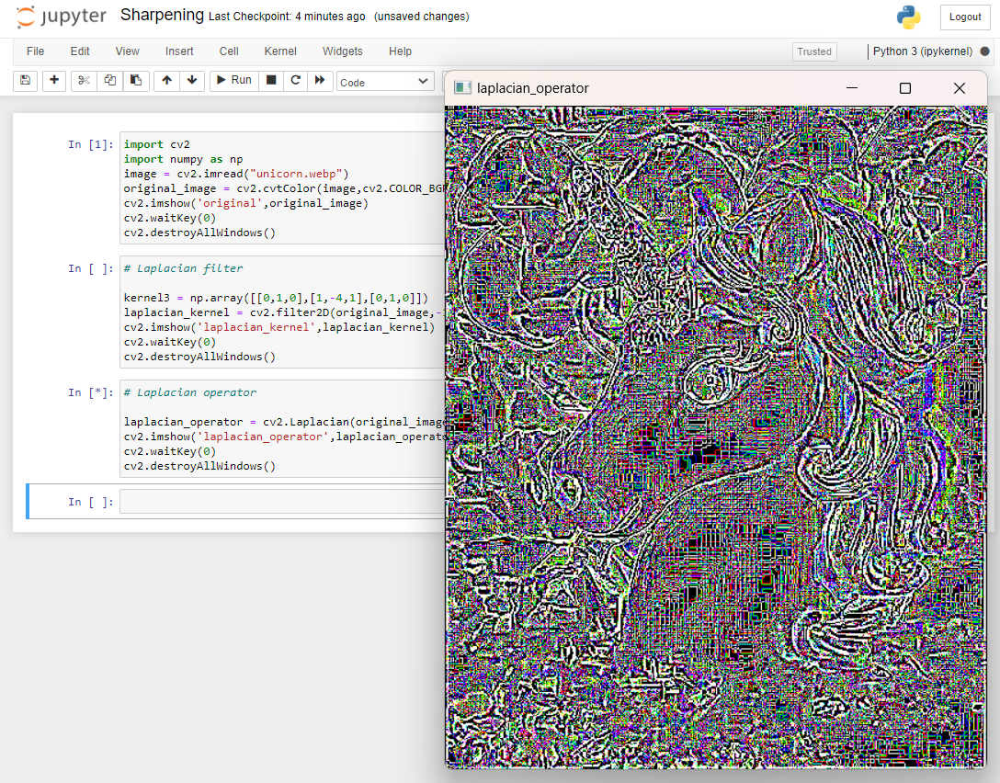

# IMPLEMENTATION-OF-FILTERS
## AIM:
To implement filters for smoothing and sharpening the images in the spatial domain.

## SOFTWARE REQUIRED:
Anaconda - Python 3.7

## ALGORITHM:
### Step1:
Read and display the image in which the filter methods have to be implemented.

### Step2:
Design the required filter methods of smoothing and sharpening that has to be performed on the image.

### Step3
Display the output images. 
## PROGRAM:
Developed By : Shrruthilaya G

Register Number : 212221230097
</br>

### 1. SMOOTHING FILTERS

i) Using Averaging Filter
```
import cv2
import numpy as np
image = cv2.imread("unicorn.webp")
original_image = cv2.cvtColor(image,cv2.COLOR_BGR2RGB)
cv2.imshow('original',original_image)
cv2.waitKey(0)
cv2.destroyAllWindows()

# Box filter

kernel1 = np.ones((11,11),np.float32)/121
box_filter = cv2.filter2D(original_image,-1,kernel1)
cv2.imshow('box_filter',box_filter)
cv2.waitKey(0)
cv2.destroyAllWindows()
```
ii) Using Weighted Averaging Filter
```
# Weighted filter

kernel2 = np.array([[1,2,1],[2,4,2],[1,2,1]])/16
weighted_filter = cv2.filter2D(original_image,-1,kernel2)
cv2.imshow('weighted_filter',weighted_filter)
cv2.waitKey(0)
cv2.destroyAllWindows()
```
iii) Using Gaussian Filter
```
# Gaussian filter

gaussian_blur = cv2.GaussianBlur(src = original_image, ksize = (11,11), sigmaX=0, sigmaY=0) 
cv2.imshow('gaussian_filter',gaussian_blur)
cv2.waitKey(0)
cv2.destroyAllWindows()
```

iv) Using Median Filter
```
# Median filter 

median = cv2.medianBlur(src=original_image,ksize = 11)
cv2.imshow('median_filter',median)
cv2.waitKey(0)
cv2.destroyAllWindows()
```

### 2. SHARPENING FILTERS
i) Using Laplacian Kernal
```
# Laplacian filter

kernel3 = np.array([[0,1,0],[1,-4,1],[0,1,0]]) 
laplacian_kernel = cv2.filter2D(original_image,-1,kernel3)
cv2.imshow('laplacian_kernel',laplacian_kernel)
cv2.waitKey(0)
cv2.destroyAllWindows()
```
ii) Using Laplacian Operator
```
# Laplacian operator

laplacian_operator = cv2.Laplacian(original_image,cv2.CV_64F)
cv2.imshow('laplacian_operator',laplacian_operator)
cv2.waitKey(0)
cv2.destroyAllWindows()
```

## OUTPUT:
### 1. Smoothing Filters

Original image


i) Using Averaging Filter


ii) Using Weighted Averaging Filter


iii) Using Gaussian Filter


iv) Using Median Filter


### 2. Sharpening Filters


i) Using Laplacian Kernel


ii) Using Laplacian Operator



## RESULT:
Thus, the filters are designed for smoothing and sharpening the images in the spatial domain.
